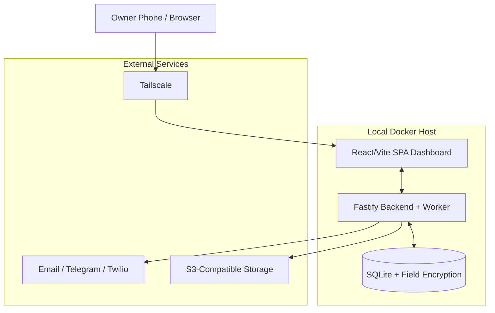
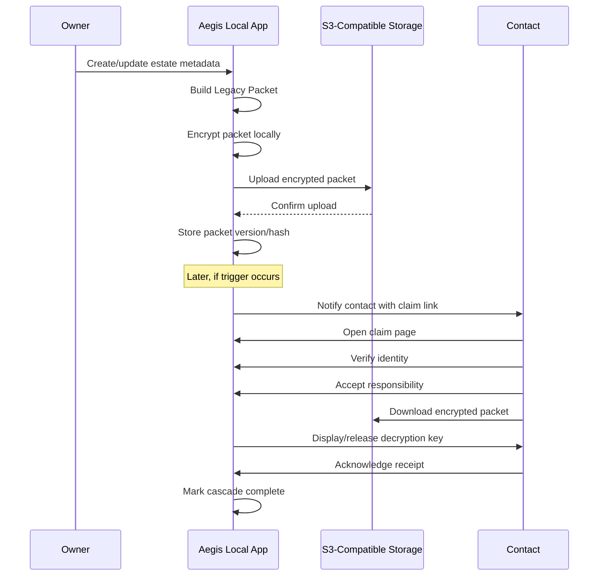
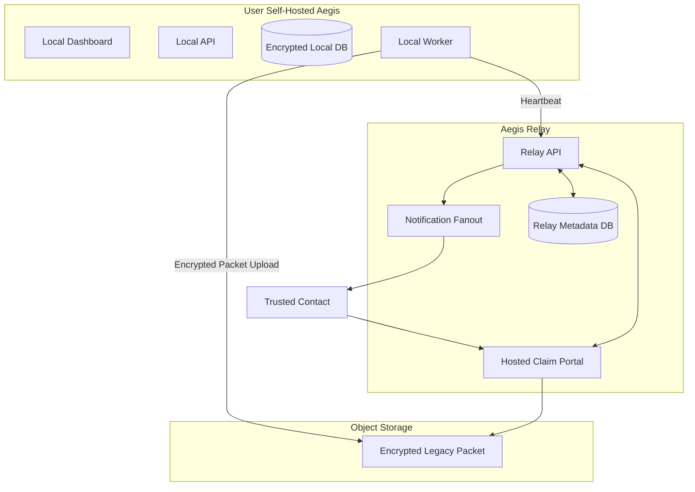

# Project Aegis — Digital Legacy Release & Dead Man’s Switch

**Product Requirements Document (PRD)**  
**Author:** Eric  
**Date:** April 2026  
**Status:** Rebuilt PRD / Build-Ready Direction  
**Working Name:** Project Aegis  

---

## 1. Executive Summary

Project Aegis is a lightweight, privacy-first digital legacy release system. It helps a user securely deliver critical estate, account, asset, and executor guidance information to designated loved ones, next-of-kin, or will executors if the user fails to check in.

Aegis is not a password manager, not a will, and not a replacement for an estate attorney. It is a secure instruction and asset-metadata release tool.

The core product is an open-source, self-hosted Docker application designed for privacy-conscious users who want to run the system on their own infrastructure, such as Unraid, TrueNAS, a mini-PC, a Raspberry Pi, a home server, or a low-cost VPS. The commercial strategy layers paid reliability and convenience services on top of the open-source core.

Aegis supports two primary trigger models:

1. **Trip Mode** — the user sets a specific trigger date/time, such as “three days after I return from Europe.”
2. **Heartbeat Mode** — the user sets a recurring check-in interval, such as “I must check in every 14 days or the release process begins.”

The product should be positioned as a **digital legacy release system** rather than only a traditional dead man’s switch, because it supports both scheduled trip-based triggers and recurring heartbeat workflows.

Aegis stores no login credentials or passwords. Its purpose is to store and release estate-relevant metadata and instructions, such as:

- Institution names.
- Account types.
- Partial account/reference numbers.
- Asset descriptions.
- Safe deposit box details.
- Insurance details.
- Real estate notes.
- Vehicle notes.
- Digital asset instructions.
- Executor guidance.
- Location of legal documents.
- Emergency instructions.

The open-source app can run fully self-hosted. A paid **Aegis Relay** service can provide cloud-based heartbeat monitoring, reliable notification delivery, claim portals, and release continuity if the user’s home server goes offline. A fully hosted SaaS version can serve non-technical users who do not want to run Docker or configure storage, Tailscale, SMTP, or SMS providers.

The major architectural improvement from the original PRD is that Aegis must not rely exclusively on a local Docker container to build and upload the release packet after the trigger time. A self-hosted server may be offline, destroyed, disconnected, or powered down when it is needed most. Therefore, the recommended architecture includes an encrypted **Dead Drop** model, where the latest encrypted legacy packet is periodically uploaded offsite while the user is alive.

---

## 2. Product Positioning

### 2.1 One-Sentence Description

Aegis is a privacy-first digital legacy release system that securely delivers estate and asset instructions to trusted contacts if the owner fails to check in.

### 2.2 Short Product Description

Aegis helps people prepare for worst-case scenarios without handing passwords or sensitive estate details to a third party. Users enter account metadata, asset descriptions, executor instructions, and trusted contacts. Aegis reminds the user to check in. If the user does not check in, Aegis begins a controlled release process using encrypted packets, ordered contacts, confirmation windows, and escalation rules.

### 2.3 Open-Source Positioning

The open-source core should be trustworthy, useful, and genuinely functional on its own.

It should not feel like crippleware. However, it should be honest about the reliability limits of a purely local system.

The commercial upsell should not be “pay us or the app is useless.” The upsell should be:

> “Run the private app yourself, but use Aegis Relay if you want the release process to continue even if your home server goes offline.”

### 2.4 Commercial Positioning

The paid products should be positioned around reliability, ease of use, and executor support:

- **Aegis Relay:** cloud reliability layer for self-hosted users.
- **Aegis Hosted:** fully managed SaaS for non-technical users.
- **Aegis Helper Pack:** premium executor guidance based on the user’s asset and institution list.

### 2.5 Positioning Language

Aegis should be positioned as **open-source and hosted legacy-release infrastructure**, not merely "a self-hosted dead man’s switch."

Recommended positioning:

> Aegis is legacy-release infrastructure for apps and individuals.
>
> Aegis Core helps self-hosters prepare and control encrypted legacy packets.
>
> Aegis Relay adds cloud monitoring, hosted claim flows, and optional release escrow for self-hosted users.
>
> Aegis Hosted gives non-technical users a fully managed way to prepare, monitor, and release critical estate information.
>
> DeadDrop API will let third-party platforms embed encrypted legacy packet, heartbeat, claim, and release workflows into their own products.

Better short descriptions:

- "Open-source and hosted legacy-release infrastructure."
- "Encrypted legacy packet release for self-hosters, families, and platforms."

---

## 2A. Product Map

The Aegis product family consists of four clearly delineated product surfaces. All share compatible contracts and domain models.

### 1. Aegis Core

- Open-source self-hosted app.
- AGPL-3.0.
- SQLite, Docker, single-owner.
- Useful without SaaS — not crippleware.
- Can optionally connect to Relay.
- Repo: `aegis/`

Primary audience: self-hosters, homelab users, privacy-conscious users, technical users who want to run their own legacy-release system, people who prefer Docker/Unraid/TrueNAS/VPS/Pi deployments.

Primary characteristics:

- Field-level AES-256-GCM encryption.
- User-configured SMTP/Telegram.
- User-configured S3-compatible storage.
- Local worker polling loop.
- DeadDrop protocol contracts implemented locally.

### 2. Aegis Relay

- Paid SaaS feature for self-hosted users.
- Provides cloud heartbeat monitoring, hosted claim portal, fallback notifications, and optional Relay Escrow.
- Does not replace the local app.

Relay supports two clearly named sub-modes:

**Relay Monitoring:** Detects missed heartbeats and sends alerts/fallback notifications, but the self-hosted Aegis Core instance still performs final release if online. Relay Monitoring increases awareness. It does not claim guaranteed release if it does not possess enough release material to do so.

**Relay Escrow:** An explicit paid/trusted mode where the user opts into SaaS-held release material or release authority sufficient for SaaS to complete the configured release flow if the local host remains offline. Relay Escrow increases release resilience. It requires clear user acknowledgement and trust in Aegis SaaS.

> Relay Monitoring increases awareness. Relay Escrow increases release resilience.

### 3. Aegis Hosted

- Paid fully managed SaaS app.
- For non-technical users who do not want to self-host.
- Uses the same domain concepts but runs fully inside Aegis SaaS.
- Repo: `aegis-dms-site/`

Hosted includes: managed dashboard, managed estate/contact data, managed packets, managed switch engine, managed claim portal, managed notifications, managed storage, billing, Helper Pack, guided onboarding, and legal/privacy disclaimers.

Aegis Hosted should not be shelved because of the DeadDrop API direction. Hosted is still an important direct product and a reference implementation of the same infrastructure.

### 4. DeadDrop API

- Future infrastructure/API product.
- Lets third-party platforms embed encrypted legacy packet, release-run, heartbeat, claim, webhook, notification, and storage workflows.
- Should be designed for from day one through contracts, but does not replace the direct Aegis products.
- Does not need to be a public shipping product in the first implementation pass, but the contracts and internal architecture should be designed as if it will become one.

Potential customers: estate-planning SaaS, online will/trust platforms, secure document vaults, crypto inheritance tools, self-custody platforms, family-office tooling, financial organizer apps, insurance-adjacent products, smaller password/security apps that do not want to build release infrastructure.

> DeadDrop API is the future infrastructure/platform layer behind Aegis. It is not a replacement for Aegis Core, Aegis Relay, or Aegis Hosted. These are platform expansion items. They should inform architecture now, but they do not block the initial Aegis Core, Relay, or Hosted implementation.

---

## 3. Product Principles

### 3.1 Privacy-First

Aegis should avoid storing passwords, login credentials, seed phrases, recovery codes, private keys, or full financial credentials.

The product should focus on metadata and instructions, not account access.

### 3.2 User-Controlled

Self-hosted users should be able to run the app without depending on Aegis as a company.

The open-source core should support a local-only mode and a self-hosted dead-drop mode.

### 3.3 Resilience-Transparent

The app must clearly explain what each deployment mode can and cannot survive.

A local-only self-hosted system cannot survive every disaster. Aegis must not imply otherwise.

### 3.4 No False Sense of Estate Finality

Aegis is not a will, trust, power of attorney, executor appointment, beneficiary designation, or legal estate plan.

The product must repeatedly clarify:

> Aegis helps your trusted people find information. It does not legally transfer ownership, override account terms, or replace estate documents.

### 3.5 Separation of Duties

Where possible, Aegis should separate:

- Encrypted packet location.
- Decryption key delivery.
- Contact verification.
- Final acknowledgement.
- Audit log.

This reduces the risk of accidental or malicious release.

### 3.6 Build for Self-Hosters First, But Not Only Self-Hosters

The GitHub repo should be straightforward for technical users.

The paid hosted product should remove setup friction for normal users.

---

## 4. Original Prompt Evaluation

This section captures the strongest parts of the original idea and the parts that need to be corrected in the rebuilt PRD.

### 4.1 Strong Original Inputs to Preserve

| Original Input | Decision | Reason |
|---|---:|---|
| Open-source repo | Preserve | Creates trust and gives self-hosters a reason to adopt. |
| Lightweight Docker stack | Preserve | Fits Unraid, TrueNAS, mini-PCs, Raspberry Pi, and VPS users. |
| Tailscale access | Preserve | Good default for private remote access without public port exposure. |
| No passwords or credentials | Preserve and strengthen | Central to reducing liability, user fear, and breach impact. |
| Ordered contact cascade | Preserve | One of the strongest product mechanics. |
| Encrypted remote packet | Preserve | Necessary for offsite resilience. |
| Paid hosted/enhanced version | Preserve | Natural business model. |
| Helper Pack with institution info | Preserve as premium feature | Strong paid differentiator. |

### 4.2 Original Inputs That Need Reframing

| Original Input | Issue | Rebuilt Direction |
|---|---|---|
| Set a target trigger date/time | This is trip-mode behavior, not a full recurring dead man’s switch. | Support both **Trip Mode** and **Heartbeat Mode**. |
| Pull data from Vaultwarden | Vaultwarden/Bitwarden vault data is encrypted by design and not a simple metadata API. | Make native Aegis data entry the MVP. Add Bitwarden/Vaultwarden import later. |
| iMessage via Apple Shortcuts | Device-dependent and unreliable if the user’s phone is lost/destroyed. | Treat as optional local reminder only, not part of reliable trigger delivery. |
| Google Drive/Dropbox link-access storage | OAuth and provider-specific quirks complicate self-hosted reliability. | MVP should support S3-compatible storage first. |
| One-click “I’m Alive” links | Vulnerable if email/SMS/device is compromised. | Require authentication before disarming or extending the trigger. |
| Encrypt/upload only after trigger | Fails if the local server is offline/destroyed at trigger time. | Periodically sync encrypted dead-drop packets while the user is alive. |

---

## 5. Target Users

### 5.1 Primary Open-Source Users

- Self-hosting hobbyists.
- Unraid users.
- TrueNAS users.
- Homelab users.
- Privacy-focused technologists.
- Digital nomads with self-hosted infrastructure.
- People who already use Tailscale, Cloudflare R2, Docker, and password managers.

### 5.2 Primary Paid Relay Users

- Self-hosters who want better reliability without giving up local control.
- Users who want the private dashboard at home but want cloud-based monitoring and contact delivery.
- Users who understand that a local server can fail and want a fallback path.

### 5.3 Primary Hosted SaaS Users

- Non-technical individuals.
- Families preparing for travel.
- Couples who want a practical emergency information system.
- Executors who want organized information but not credentials.
- People with complex assets but no desire to self-host.

### 5.4 Secondary Users

- Estate attorneys who want clients to maintain organized executor packets.
- Financial planners.
- Insurance advisors.
- Family offices.
- Small business owners.
- Operators with critical continuity documents.

---

## 6. Core Use Cases

### 6.1 Trip Scenario

A user and spouse are traveling internationally. They want a trusted brother, then father, then sister to receive instructions if something happens to both of them.

The user sets:

- Trip return date.
- Grace period after return.
- Reminder schedule.
- Ordered contact list.
- Release packet contents.

If the user checks in, nothing is released.

If the user fails to check in, Aegis begins the contact cascade.

### 6.2 Recurring Heartbeat Scenario

A user wants a standing safety mechanism that requires check-in every 14 days.

The user sets:

- Heartbeat interval.
- Warning window.
- Contact cascade.
- Dead-drop sync.
- Release rules.

If the user misses the recurring heartbeat, Aegis enters warning mode, then release mode.

### 6.3 Self-Hosted Privacy Scenario

A privacy-conscious user runs Aegis on Unraid and uses Tailscale for access.

They do not want Aegis-the-company to have their estate data.

They choose:

- Local-only or self-hosted dead-drop mode.
- Local authentication.
- S3-compatible encrypted storage.
- Email and Telegram notifications.

### 6.4 Self-Hosted Reliability Scenario

A user runs Aegis locally but pays for Aegis Relay.

The local app keeps estate details private and syncs encrypted release material. The relay monitors heartbeats and can continue the notification cascade if the home server goes offline.

### 6.5 Fully Hosted Scenario

A non-technical user signs up for Aegis Hosted.

They do not configure Docker, Tailscale, SMTP, Twilio, or S3. Aegis provides the dashboard, encrypted storage, reminders, contact claim portal, and Helper Pack.

---

## 7. Deployment Modes

The PRD must explicitly define deployment modes so users understand what problem each mode solves and what risks remain.

### 7.1 Mode A — Vault Mode

**Description:**  
The entire app runs locally on the user’s hardware or VPS. This is local planning and storage without guaranteed automated release.

Vault Mode stores and organizes your legacy packet locally. It does not guarantee automated release if this machine is offline, destroyed, inaccessible, or unable to notify your contacts. If no external notification provider and no reachable claim portal exists, this mode should be understood as local planning only.

**Typical Environment:**

- Unraid.
- TrueNAS.
- Mini-PC.
- Raspberry Pi.
- Home server.
- Local Docker host.
- Low-cost VPS.

**Capabilities:**

- Local encrypted database.
- Dashboard.
- Contact management.
- Trip Mode.
- Heartbeat Mode.
- Reminder scheduling.
- Local trigger processing.
- Email/SMS/Telegram notifications if configured.
- Local audit log.

**Strengths:**

- Maximum user control.
- No Aegis cloud dependency.
- Lowest cost.
- Strong privacy.

**Limitations:**

- If the host is offline at trigger time, Aegis may not release anything.
- If the server is destroyed, stolen, disconnected, powered down, or unable to reach notification providers, release may fail.
- User is responsible for backups, uptime, storage, and notification provider setup.

**Required Warning in UI:**

> Vault Mode is privacy-maximal but resilience-limited. If this machine is offline, destroyed, or disconnected at trigger time, Aegis may not be able to notify contacts or release your packet.

---

### 7.2 Mode B — Self-Hosted Dead-Drop Mode

**Description:**  
Aegis runs locally but periodically uploads an encrypted legacy packet to S3-compatible storage while the user is alive.

**Capabilities:**

- Everything in Local-Only Mode.
- Periodic encrypted packet generation.
- Offsite encrypted storage.
- Versioned packet metadata.
- Object hash verification.
- Optional presigned release link generation.

**Strengths:**

- Better resilience than local-only.
- Latest packet is already offsite before a trigger occurs.
- Remote storage never receives plaintext.
- Still does not require Aegis-the-company.

**Limitations:**

- If the local server is offline at trigger time, it may still be unable to notify contacts or release keys.
- The encrypted packet may exist remotely, but contacts may not know how to claim it unless the release flow still executes.

**Required Warning in UI:**

> Dead-Drop Mode keeps an encrypted packet offsite, but release still depends on your local Aegis server unless Aegis Relay or another independent release mechanism is enabled.

---

### 7.3 Mode C1 — Self-Hosted + Relay Monitoring

**Description:**  
The user runs the private Aegis app locally, and an Aegis cloud relay monitors heartbeats and sends alerts. The self-hosted Aegis Core instance still performs final release if online. Relay Monitoring detects offline state and increases awareness, but the local host may still be required for final release.

**Capabilities:**

- Everything in Self-Hosted Dead-Drop Mode.
- Cloud heartbeat tracking.
- Offline detection.
- Owner alerts.
- Contact warning notifications.
- Dashboard status.
- Delivery monitoring.
- Operational audit events.

**Strengths:**

- Preserves local ownership of estate data.
- Provides early warning of host problems.
- Creates clear paid value.
- Improves notification deliverability for owner alerts.

**Limitations:**

- Relay Monitoring does not claim it can complete release if it does not possess enough release material to do so.
- If the local host is permanently offline and no escrow/release material exists on the relay, automated release may not complete.
- Not as private as strict local-only operation.

**Required Warning in UI:**

> Relay Monitoring tracks your heartbeat from the cloud and sends alerts if your server goes offline. However, if your local server is permanently unavailable, the release process may not complete unless Relay Escrow is also enabled.

---

### 7.3b Mode C2 — Self-Hosted + Relay Escrow

**Description:**  
The user runs the private Aegis app locally, and an Aegis cloud relay both monitors heartbeats and holds enough release material or authority to complete the release workflow if the local server remains offline. This is an explicit trusted mode where the user opts into SaaS-held release material.

**Capabilities:**

- Everything in Relay Monitoring.
- Hosted claim portal.
- Cloud-controlled release execution.
- Fallback contact cascade.
- Managed notification retries.
- Packet/key release according to configured policy.
- Release receipts.
- Contact acknowledgement tracking.
- Optional managed object storage.
- Optional Helper Pack generation.

**Strengths:**

- Preserves local ownership of estate data during normal operation.
- Solves most home-server downtime problems.
- Creates clear paid value.
- Highest resilience for self-hosted users.
- Improves notification deliverability.

**Limitations:**

- Requires explicit trust in Aegis SaaS as a trusted release service.
- Not as private as strict local-only or Relay Monitoring-only operation.
- Increases resilience but requires trusting Aegis with release authority or release material under the configured policy.

**Required Warning in UI:**

> In Relay Escrow mode, Aegis SaaS becomes a trusted release service. This increases resilience but requires trusting Aegis with release authority or release material under the configured policy. If your local server is unavailable, the relay can complete the release workflow according to your settings.

---

### 7.4 Mode D — Fully Hosted SaaS

**Description:**  
Aegis hosts the dashboard, storage, reminders, claim portal, release workflow, and premium features.

**Capabilities:**

- No Docker required.
- No Tailscale required.
- No S3 setup required.
- No SMTP/Twilio setup required.
- Managed dashboard.
- Managed notifications.
- Managed packet storage.
- Managed claim portal.
- Helper Pack generation.
- Support and onboarding.

**Strengths:**

- Best for normal users.
- Easiest setup.
- Highest operational reliability.
- Best commercial opportunity.

**Limitations:**

- Requires trusting Aegis as a hosted provider.
- Requires a careful hosted encryption and privacy design.
- Higher legal/compliance burden.

---

## 8. Version and Feature Split

### 8.1 MVP v1 — Open-Source Aegis Core (Alpha)

The MVP should be a complete, useful, self-hosted product. This is an alpha release — not production-ready for users who depend on guaranteed release.

Required v1 features:

- Docker Compose deployment.
- React + Vite SPA dashboard.
- Fastify backend (TypeScript).
- SQLite local database (via Drizzle ORM).
- Application-level AES-256-GCM field encryption for sensitive columns.
- First-run setup wizard.
- Local admin passphrase.
- Optional TOTP.
- Native estate metadata editor.
- Ordered contact list.
- Trip Mode.
- Heartbeat Mode.
- Reminder schedule.
- Email notifications.
- Telegram notifications.
- Optional Twilio SMS.
- S3-compatible encrypted dead-drop storage.
- Persistent workflow state machine.
- Contact cascade.
- Claim links.
- Key-release flow.
- Contact acknowledgement flow.
- Audit log.
- Manual test-run mode.
- Disaster/reliability warnings.
- Backup/export of local configuration.

### 8.2 Explicitly Not in MVP v1

The following should not be in the first open-source MVP:

- Live Vaultwarden sync.
- Live Bitwarden sync.
- Google Drive provider.
- Dropbox provider.
- OneDrive provider.
- iCloud Drive provider.
- iMessage release workflow.
- Native iOS app.
- Native Android app.
- AI Helper Pack.
- Bank contact automation.
- Legal process automation.
- Full hosted SaaS.
- Contact public-key onboarding.
- Attorney/family-office workflows.

### 8.3 v1.5 / v2 Features

Likely next features:

- Aegis Relay integration.
- Hosted claim portal.
- Offline host monitoring.
- Relay-backed escalation timers.
- Managed R2/S3 storage option.
- CSV import.
- Markdown estate template import.
- Bitwarden JSON export import.
- Bitwarden CLI-assisted import.
- Contact pre-enrollment.
- Additional notification providers.
- More advanced audit exports.

### 8.4 Premium / Hosted Features

Paid features:

- Aegis Relay.
- Fully hosted dashboard.
- Managed notifications.
- Managed storage.
- Managed claim portal.
- Helper Pack generation.
- Institution-specific executor instructions.
- Bank contact directories.
- Estate-processing checklist templates.
- Priority support.
- Family onboarding.
- Attorney/planner collaboration.

---

## 9. Technical Stack

### 9.1 Frontend

**Stack:** React 18 + Vite + Tailwind CSS (SPA).

Requirements:

- Mobile-first dashboard.
- Installable PWA behavior.
- Responsive design.
- Local admin UI.
- Contact management UI.
- Packet status UI.
- Trigger status UI.
- Audit log UI.
- Setup wizard.
- Test-run UI.

### 9.2 Backend

**Stack:** Fastify (TypeScript).

Responsibilities:

- Authentication.
- Estate metadata API.
- Contact cascade state machine.
- Notification sending.
- Packet creation.
- Packet encryption.
- S3 upload/delete.
- Heartbeat logic.
- Trigger evaluation.
- Audit logging.
- Healthchecks.
- Serves Vite build as static files in production.

### 9.3 Database

**Stack:** SQLite (OSS, via better-sqlite3 + Drizzle ORM), PostgreSQL (SaaS, via Drizzle ORM).

Encryption: Application-level AES-256-GCM field encryption for sensitive columns. No SQLCipher (avoids ARM binary complexity for Raspberry Pi users).

Requirements:

- Database must live on a persistent Docker volume.
- Critical release state must be persisted.
- No critical workflow may depend only on in-memory state.
- Database backup/export must be supported.

### 9.4 Scheduler / Workflow Engine

Do not rely on in-memory background jobs for critical logic.

Recommended approach:

- Database-driven state machine.
- Polling worker loop every 30–60 seconds.
- Idempotent actions.
- Durable workflow states.
- Durable notification logs.
- Retry-safe execution.

The scheduler should repeatedly evaluate persisted state:

```text
Every 60 seconds:
  read active switches from DB
  find due reminders
  find due trigger events
  find due contact escalation events
  execute idempotent actions
  write state transition to audit log
```

This is simpler and safer than relying on ephemeral background jobs.

### 9.5 Remote Access

**Recommended for self-hosters:** Tailscale.

Tailscale provides private network access, but it must not be treated as full application authentication.

Aegis must still require its own login.

### 9.6 Storage

**MVP storage provider:** S3-compatible object storage.

Supported target types:

- Cloudflare R2.
- AWS S3.
- Backblaze B2 S3 API.
- Wasabi.
- MinIO.
- Any compatible endpoint.

Google Drive, Dropbox, OneDrive, and iCloud Drive should be future plugins, not MVP requirements.

### 9.7 Notifications

MVP notification channels:

- Email via SMTP.
- Email via API provider, such as Resend or SendGrid.
- Telegram Bot API.
- Optional Twilio SMS.

Future notification channels:

- Signal.
- WhatsApp Business.
- Push notifications.
- Native app notifications.
- iMessage via device-side automation, reminder-only.

---

## 10. Data Model

### 10.1 User / Owner

Fields:

- owner_id
- display_name
- email
- phone
- timezone
- preferred_reminder_channels
- authentication_settings
- created_at
- updated_at

### 10.2 Aegis Switch

Represents a configured legacy release workflow.

Fields:

- switch_id
- owner_id
- mode: `trip` or `heartbeat`
- deployment_mode: `vault`, `dead_drop`, `relay_monitoring`, `relay_escrow`, `hosted`
- status: `draft`, `armed`, `warning`, `triggered`, `cascade_active`, `completed`, `cancelled`, `paused`, `failed`
- trigger_at
- heartbeat_interval_days
- next_check_in_due_at
- warning_starts_at
- grace_period_hours
- created_at
- updated_at
- last_check_in_at
- last_packet_sync_at

### 10.3 Estate Item

Represents account metadata, asset descriptions, or executor instructions.

Fields:

- item_id
- owner_id
- category
- institution_name
- account_type
- reference_hint
- partial_account_number
- asset_description
- location_notes
- executor_notes
- legal_document_reference
- sensitive_flag
- created_at
- updated_at

Important rule:

> Aegis should strongly discourage storing passwords, full account numbers, private keys, recovery seed phrases, or login credentials.

### 10.4 Contact

Represents a trusted contact in the cascade.

Fields:

- contact_id
- owner_id
- full_name
- relationship
- priority_order
- email
- phone
- telegram_handle
- preferred_channels
- confirmation_window_hours
- identity_verification_method
- backup_notes
- created_at
- updated_at

### 10.5 Packet

Represents a generated encrypted legacy packet.

Fields:

- packet_id
- owner_id
- switch_id
- version
- created_at
- expires_at
- encryption_algorithm
- key_id
- content_hash
- encrypted_object_hash
- storage_provider
- storage_bucket
- storage_object_key
- storage_region
- presigned_url_status
- deletion_status
- last_verified_at

### 10.6 Contact Claim

Represents a contact’s interaction with the release process.

Fields:

- claim_id
- switch_id
- packet_id
- contact_id
- status
- notified_at
- opened_at
- verified_at
- accepted_at
- packet_downloaded_at
- key_viewed_at
- acknowledged_at
- expires_at
- escalated_at
- failed_at

Claim statuses:

```text
pending
notified
opened_claim
verified
accepted_responsibility
packet_downloaded
key_viewed
acknowledged
expired
escalated
failed
```

### 10.7 Audit Event

Fields:

- audit_event_id
- owner_id
- switch_id
- event_type
- actor_type
- actor_id
- timestamp
- metadata_json

Audit event examples:

- setup_completed
- switch_armed
- switch_paused
- switch_cancelled
- check_in_completed
- reminder_sent
- reminder_failed
- packet_generated
- packet_uploaded
- packet_deleted
- trigger_reached
- contact_notified
- contact_opened_claim
- contact_verified
- contact_accepted
- packet_downloaded
- key_viewed
- claim_acknowledged
- contact_escalated
- cascade_completed
- relay_heartbeat_sent
- relay_offline_warning_received

---

## 11. Data Storage and Zero-Credential Policy

### 11.1 Core Policy

Aegis must not be marketed or designed as a password escrow product.

Aegis must not intentionally store:

- Passwords.
- Full login credentials.
- 2FA backup codes.
- Crypto seed phrases.
- Private keys.
- Full account numbers unless the user explicitly overrides warnings.
- Password manager master passwords.

### 11.2 Allowed Information

Aegis may store:

- Bank/institution names.
- Account types.
- Last 4–8 digits or partial reference numbers.
- Approximate asset descriptions.
- Location of documents.
- Names of attorneys, advisors, insurance agents, or institutions.
- Instructions for where to find a safe, will, trust, binder, or password manager family plan.
- Executor notes.
- Contact process instructions.

### 11.3 User Override

Some users may attempt to store sensitive information anyway.

Aegis should provide:

- Strong warnings.
- Sensitive-field detection where practical.
- A “not recommended” confirmation flow.
- Audit event when sensitive override is used.

### 11.4 Vaultwarden / Bitwarden Direction

Vaultwarden/Bitwarden should not be part of the MVP data source.

Rebuilt direction:

> Aegis v1 stores estate metadata natively in its own encrypted local database. Future versions may import from Bitwarden/Vaultwarden using user-initiated export or CLI-based flows.

Possible future integration paths:

1. CSV import.
2. Markdown template import.
3. Bitwarden JSON export import.
4. Encrypted Bitwarden export import.
5. Bitwarden CLI-assisted import.
6. Vaultwarden companion container.

Aegis should not require users to provide their password manager master password to the Aegis backend.

---

## 12. Check-In and Trigger Logic

### 12.1 Trip Mode

Trip Mode is for a specific time-bound risk period.

Example:

> “If I do not check in by May 22 at 6:00 PM, begin release.”

Fields:

- trip_name
- trigger_at
- warning_window
- reminder_schedule
- grace_period
- selected contacts
- selected packet contents

Flow:

1. User creates Trip Mode switch.
2. User selects trigger date/time.
3. Aegis sends reminders before trigger.
4. User checks in and cancels, extends, or re-arms.
5. If no check-in occurs, Aegis enters release workflow.

### 12.2 Heartbeat Mode

Heartbeat Mode is for recurring dead man’s switch behavior.

Example:

> “I must check in every 14 days.”

Fields:

- heartbeat_interval_days
- warning_window
- grace_period
- reminder_schedule
- selected contacts
- selected packet contents

Flow:

1. User arms Heartbeat Mode.
2. Aegis calculates next check-in deadline.
3. Aegis sends reminders before deadline.
4. User checks in.
5. Aegis calculates the next deadline.
6. If the user misses the deadline and grace period, release workflow begins.

### 12.3 Warning Mode

Before release, Aegis enters warning mode.

Default warning recommendations:

- 72 hours before trigger: email + dashboard warning.
- 48 hours before trigger: email + Telegram/SMS if configured.
- 24 hours before trigger: all selected channels.
- 6 hours before trigger: all selected channels.
- 1 hour before trigger: final warning.

User should be able to configure this.

### 12.4 Check-In Authentication

A reminder link must not be a one-click disarm mechanism.

The link should open a check-in page where the user must authenticate.

Supported authentication:

- Local passphrase.
- PIN plus device trust.
- TOTP.
- WebAuthn/passkey.
- Existing authenticated session.

Minimum MVP requirement:

> Any action that cancels, extends, pauses, or re-arms a switch must require authentication beyond possession of an email or SMS link.

---

## 13. Dead-Drop Packet Architecture

### 13.1 Problem Being Solved

If the local Docker host only builds and uploads the packet after trigger time, the system can fail if the host is unavailable.

Examples:

- House fire.
- Power outage.
- ISP outage.
- Server crash.
- Docker container stopped.
- Disk failure.
- Home network failure.
- User accidentally shuts down the NAS.

### 13.2 Recommended Architecture

Aegis should periodically generate and upload an encrypted legacy packet while the user is alive.

Flow:

```text
Aegis local app
  -> builds current Legacy Packet
  -> encrypts locally with fresh data key
  -> uploads encrypted blob to S3-compatible storage
  -> stores packet version, hash, expiry, and release state locally
```

### 13.3 Packet Sync Cadence

Default:

- Sync on every material data change.
- Sync daily while armed.
- Sync immediately when switch is armed.
- Sync immediately before entering warning mode if possible.

### 13.4 Packet Verification

After upload, Aegis should verify:

- Object exists.
- Object hash matches expected encrypted hash.
- Packet version matches local metadata.
- Storage provider credentials are still valid.

### 13.5 Packet Expiration

Aegis should support packet expiration policies.

Default recommendation:

- Remote encrypted packet expires or is rotated every 14–30 days.
- Old packets are deleted after successful new packet upload.
- If a contact cascade advances, the old packet should be deleted and a fresh packet/key should be created when possible.

### 13.6 Local-Only vs Dead-Drop Behavior

In Local-Only Mode:

- Packet may be generated only at trigger time.
- UI must warn about local failure risk.

In Dead-Drop Mode:

- Packet is generated before trigger.
- Remote encrypted packet is always available if storage is healthy.

In Relay Mode:

- Relay may know where the encrypted packet is and may be able to initiate contact release even if the home server is offline.

---

## 14. Encryption and Key Release Models

### 14.1 Packet Encryption

Minimum requirements:

- Encrypt packets locally before upload.
- Use authenticated encryption.
- Include packet metadata outside or alongside the encrypted blob only where safe.
- Never upload plaintext estate packet contents.

Recommended algorithm:

- AES-256-GCM or XChaCha20-Poly1305.

### 14.2 Key Rotation

On each release attempt, Aegis should be able to generate a fresh encryption key and fresh packet.

If Contact #1 fails to complete within the confirmation window:

1. Old packet is deleted or invalidated.
2. New packet is created if the local server is available.
3. New key is generated.
4. New storage object key/slug is created.
5. Contact #2 begins the claim process.

If the local server is unavailable and relay mode is enabled, relay behavior depends on selected key-release model.

### 14.3 Key-Release Model A — Local-Only Key Release

The local Aegis server holds the release key and sends it during the cascade.

Strengths:

- Strong privacy.
- Aegis-the-company has no key.
- Best for strict self-hosters.

Limitations:

- If the local server is offline, the key may not be released.

### 14.4 Key-Release Model B — Relay-Escrowed Key Release

The Aegis Relay holds enough release material to complete the cascade if the local server is offline.

Strengths:

- Much better resilience.
- Enables paid reliability service.
- Works for non-technical contacts.

Limitations:

- Requires trust in Aegis Relay.
- Not a strict zero-knowledge model.

Possible mitigations:

- Store only encrypted key material.
- Use split secrets.
- Require contact verification before display.
- Log every release action.
- Allow user to choose this mode explicitly.

### 14.5 Key-Release Model C — Contact Public-Key Encryption

Contacts pre-enroll with public keys. Aegis encrypts the packet key to each contact’s public key.

Strengths:

- Best cryptographic model.
- Relay can help deliver without seeing plaintext key.

Limitations:

- Hard contact onboarding.
- Too much friction for MVP.
- Better as advanced/future feature.

### 14.6 MVP Recommendation

MVP should support:

1. Local-only key release for open-source core.
2. Relay-assisted key release for paid relay.

Future should support:

3. Contact public-key release.

---

## 15. Contact Cascade Protocol

### 15.1 Basic Cascade

Contacts are ordered by priority.

Example:

1. Brother.
2. Father.
3. Sister.
4. Attorney.

Aegis starts with Contact #1. If Contact #1 does not complete the claim process within the window, Aegis escalates to Contact #2.

### 15.2 Contact Notification

A contact receives:

- Notification that the user’s Aegis release process has started.
- Clear explanation of what Aegis is.
- Claim link.
- Expiration window.
- Instructions.
- Warning that this may relate to an emergency or estate event.

The first notification should avoid exposing unnecessary sensitive details.

### 15.3 Contact Verification

Before receiving the key, the contact should verify identity.

MVP options:

- Email claim link plus SMS code.
- SMS claim link plus email code.
- Preconfigured claim PIN.
- Relay-hosted secure claim portal.

### 15.4 Acceptance Step

The contact must explicitly accept responsibility.

Example confirmation:

> I understand that I may be receiving important emergency or estate-related information. I agree to download and preserve the packet and key, and I understand that if I do not complete this process in time, Aegis may escalate to the next contact.

### 15.5 Download and Key Access

The cascade should not stop merely because the contact clicked a link.

The release should be considered complete only after:

1. Contact verifies identity.
2. Contact accepts responsibility.
3. Contact downloads or accesses the encrypted packet.
4. Contact views or copies the decryption key.
5. Contact acknowledges receipt.

### 15.6 Pausing vs Completing

A contact may start the process but fail to finish.

Recommended rule:

> The cascade pauses when a contact verifies and accepts responsibility. It only completes when the contact accesses both the packet and key and acknowledges receipt. If the contact does not complete within the configured window, Aegis escalates to the next contact.

### 15.7 Confirmation Windows

Recommended defaults:

- Primary contact: 48–72 hours.
- Secondary contacts: 24 hours.
- Later contacts: 12–24 hours.

Reasoning:

- The primary contact may be grieving, traveling, overwhelmed, or not checking spam folders.
- Later escalation should move faster because the system has already failed to reach the preferred contact.

### 15.8 Escalation Behavior

If a contact expires:

1. Mark claim as expired.
2. Delete or invalidate prior packet link when possible.
3. Rotate packet/key when possible.
4. Notify next contact.
5. Write audit event.

If all contacts are exhausted:

- Delete remote packet if configured.
- Mark switch as `completed_failed_no_contact` or similar.
- Write final audit event.
- In relay/hosted mode, optionally send final failure notice to predefined administrative contact if configured.

---

## 16. Authentication and Access Control

### 16.1 Tailscale Is Not Enough

Tailscale is useful for private network access, but Aegis must not rely on Tailscale alone as authentication.

Anyone with access to the relevant tailnet/device route could potentially reach the app if no app-level authentication exists.

### 16.2 Required App Authentication

Minimum MVP:

- First-run admin account.
- Local passphrase.
- Argon2id password hashing.
- Session timeout.
- CSRF protection.
- Secure cookies.

Recommended MVP+:

- Optional TOTP.
- Optional WebAuthn/passkey.
- Recovery codes.
- Trusted device list.

### 16.3 Sensitive Actions Requiring Reauthentication

The following actions should require fresh authentication:

- Disarm switch.
- Extend trigger date.
- Pause switch.
- Change contact list.
- Change packet contents.
- Change storage provider.
- Change notification provider.
- Reveal or export encryption material.
- Delete audit logs.
- Change authentication settings.

### 16.4 Contact Claim Authentication

Contact claims should require more than possession of one communication channel.

Examples:

- Email link + SMS code.
- SMS link + email code.
- Pre-shared claim PIN.
- Contact-specific claim code.
- Future: passkey or public-key pre-enrollment.

---

## 17. Notification System

### 17.1 Owner Reminders

Supported MVP channels:

- Email.
- Telegram.
- Optional SMS via Twilio.

Reminder types:

- Upcoming check-in reminder.
- Warning mode reminder.
- Final warning reminder.
- Successful check-in confirmation.
- Switch armed confirmation.
- Switch paused/cancelled confirmation.
- Packet sync failure.
- Storage provider failure.
- Notification provider failure.

### 17.2 Contact Notifications

Supported MVP channels:

- Email.
- SMS if configured.
- Telegram if configured.

Contact notifications should be redundant but not reckless.

### 17.3 iMessage Position

iMessage via Apple Shortcuts should not be part of the reliable release workflow.

It may be supported later as a convenience reminder for the owner only.

Reason:

- Shortcuts run on the user’s device.
- The device may be unavailable or destroyed.
- It cannot be relied upon for emergency release.

### 17.4 Notification Retries

Aegis should retry failed notifications with backoff.

Example:

- Attempt immediately.
- Retry after 5 minutes.
- Retry after 30 minutes.
- Retry after 2 hours.
- Mark failed and escalate if required.

All notification attempts must be written to audit logs.

---

## 18. Storage Provider Abstraction

### 18.1 MVP Decision

MVP supports S3-compatible storage only.

This is intentional.

S3-compatible storage is better for self-hosters because it generally uses stable API credentials and predictable SDK behavior.

### 18.2 Supported MVP Providers

The app should support configuration for:

- Endpoint URL.
- Region.
- Bucket.
- Access key.
- Secret key.
- Path prefix.
- Presigned URL expiration.

This makes the app compatible with:

- Cloudflare R2.
- AWS S3.
- Backblaze B2 S3 API.
- Wasabi.
- MinIO.
- Other compatible providers.

### 18.3 Future Consumer Drive Providers

Future plugins may support:

- Google Drive.
- Dropbox.
- OneDrive.
- iCloud Drive.

These should not be MVP requirements due to OAuth complexity, token refresh fragility, and provider-specific sharing semantics.

### 18.4 Deletion Requirements

Aegis must be able to:

- Delete expired packet objects.
- Delete superseded packet objects.
- Delete contact-expired packet objects when possible.
- Mark deletion failures.
- Retry deletions.
- Warn owner if remote deletion fails.

---

## 19. Aegis Relay

### 19.1 Purpose

Aegis Relay is the paid cloud reliability layer for self-hosted users.

It exists to solve the core weakness of self-hosting:

> A self-hosted app cannot act if the host is offline, destroyed, disconnected, or powered down.

### 19.2 Relay Capabilities

Aegis Relay may provide:

- Heartbeat monitoring.
- Offline host alerts.
- Hosted contact claim portal.
- Contact notification fanout.
- Escalation timers.
- Delivery receipts.
- Packet location metadata.
- Optional managed object storage.
- Optional relay-assisted key release.
- Optional Helper Pack generation.

### 19.3 Relay Heartbeat

The local app sends periodic heartbeats to Aegis Relay.

Heartbeat includes minimal metadata:

- relay_account_id
- switch_id
- current switch status
- last local check-in timestamp
- next check-in deadline
- packet version/hash metadata
- local app version
- health status

The heartbeat should not include plaintext estate packet contents.

### 19.4 Offline Host Alerts

If the relay has not received a heartbeat for a defined period, it should notify the owner.

Default recommendation:

- Warning after 24 hours offline.
- Urgent warning after 48 hours offline.
- Optional contact pre-warning only if configured.

Example owner alert:

> Your Aegis server has been offline for 48 hours. Please verify your system. Your release workflow may not be able to run locally if this continues.

### 19.5 Relay Release Behavior

If the user misses check-in and the local server is offline, the relay may initiate release depending on configuration.

Relay behavior depends on selected key-release model:

- Local-only key release: relay can notify/warn but may not release key.
- Relay-escrowed release: relay can complete cascade.
- Future public-key release: relay can deliver encrypted key material without seeing plaintext key.

### 19.6 Relay Privacy Promise

Relay should be designed to avoid storing estate plaintext.

Relay may store:

- Contact metadata.
- Switch timing metadata.
- Packet object reference.
- Release status.
- Notification logs.
- Escrowed or encrypted key material if enabled.

Relay should not store:

- User’s estate packet plaintext.
- Passwords.
- Full account credentials.
- Password manager master passwords.

---

## 20. Fully Hosted SaaS

### 20.1 Purpose

Aegis Hosted is for users who want the outcome without self-hosting.

### 20.2 Hosted Features

- Hosted dashboard.
- Managed authentication.
- Managed storage.
- Managed notification delivery.
- Managed claim portal.
- Managed packet generation.
- Helper Pack generation.
- Family/executor onboarding.
- Support.

### 20.3 Hosted Encryption Model

This requires further design before implementation.

Options:

1. Server-side encryption managed by Aegis.
2. Client-side encryption with user-held secret.
3. Hybrid model with recovery tradeoffs.
4. Contact public-key model.

The hosted product has greater compliance and trust burden than the self-hosted app.

---

## 21. Premium Helper Pack

### 21.1 Purpose

The Helper Pack is a premium generated packet section that helps executors understand what to do next.

It should turn raw asset metadata into practical action steps.

### 21.2 Example Helper Pack Contents

For each institution or asset type, the Helper Pack may include:

- Institution contact information.
- Estate department phone number.
- Mailing address.
- Fax number if relevant.
- Bereavement or estate-processing process.
- Required documents checklist.
- Suggested call script.
- Executor action checklist.
- Notes on what not to do.
- General timeline expectations.

### 21.3 Example Output

For a bank account, Aegis might generate:

```text
Institution: Example Bank
Asset Type: Checking account
Reference: Account ending in 1234

Executor Action Checklist:
1. Locate death certificate copies.
2. Locate will/trust documents.
3. Contact Example Bank estate services department.
4. Ask what documents are required to claim or close the account.
5. Do not attempt to log into the user’s online banking account unless legally authorized.
```

### 21.4 Legal Boundary

Helper Pack must not provide legal advice.

It should use language such as:

> This checklist is informational and may not reflect the requirements of your jurisdiction or institution. Executors should consult the estate attorney, relevant institution, and applicable legal authorities.

---

## 22. Threat Model

### 22.1 Threat: Stolen Phone or Email Access

Risk:

- Attacker clicks “I’m Alive” link and prevents release.

Mitigation:

- Reminder links do not disarm by themselves.
- Check-in requires authentication.
- Sensitive actions require reauthentication.

### 22.2 Threat: SIM Swap

Risk:

- Attacker intercepts SMS-based key or verification code.

Mitigation:

- Do not send raw decryption key directly by SMS in recommended mode.
- Use secure claim portal.
- Require multi-channel verification.
- Allow user to disable SMS key delivery.
- Prefer portal-based key display after verification.

### 22.3 Threat: Malicious Contact

Risk:

- Contact tries to claim packet prematurely.

Mitigation:

- Claim links are inactive until release state begins.
- Contact cannot access packet/key before trigger.
- Claim attempts are logged.
- Optional owner alert if early claim attempt occurs.

### 22.4 Threat: Compromised Storage Bucket

Risk:

- Attacker obtains encrypted packet.

Mitigation:

- Packet is encrypted before upload.
- Storage never receives plaintext.
- Object keys should be high entropy.
- Packet hashes verified.
- Old packets deleted.
- Key delivered separately.

### 22.5 Threat: Compromised Local Server

Risk:

- Attacker with server access may access database, packet, keys, or alter release state.

Mitigation:

- Local database encryption.
- App authentication.
- File permissions.
- Optional TOTP.
- Audit log.
- Backup/recovery codes.
- Security hardening docs.

### 22.6 Threat: Host Offline at Trigger Time

Risk:

- Local app cannot notify contacts or release key.

Mitigation:

- Dead-drop mode.
- Aegis Relay.
- Offline host alerts.
- Clear UI warnings.

### 22.7 Threat: Notification Provider Failure

Risk:

- Email/SMS/Telegram does not deliver.

Mitigation:

- Multiple channels.
- Retry logic.
- Delivery logs.
- Relay option.
- Test notification feature.

### 22.8 Threat: False Trigger

Risk:

- User forgets to check in and contacts are alarmed unnecessarily.

Mitigation:

- Warning window.
- Multiple reminders.
- Grace period.
- Easy authenticated check-in.
- Pause/extend options.
- Test mode clearly separated from live mode.

### 22.9 Threat: Contact Fails Mid-Claim

Risk:

- Contact confirms but does not download/save the packet or key.

Mitigation:

- Multi-step claim state.
- Cascade pauses but does not complete until acknowledgement.
- Reminders to contact.
- Escalation if incomplete.

### 22.10 Threat: User Stores Passwords Anyway

Risk:

- Product becomes de facto credential escrow.

Mitigation:

- Strong warnings.
- Sensitive data detection.
- Explicit override confirmation.
- Product copy reinforces metadata-only use.

---

## 22A. Security Baseline Requirements

The following security requirements are non-negotiable for Phase 1 implementation. They apply to both OSS and SaaS repos.

### 22A.1 CORS

- Explicit origin allowlist. Never `origin: true` with `credentials: true` in production.
- OSS: Allow only configured `AEGIS_APP_URL` origin.
- SaaS: Allow only the known frontend domain(s).

### 22A.2 CSRF Protection

- State-changing routes require CSRF token validation.
- Use signed double-submit cookie pattern (token in cookie + header, server verifies match).
- SameSite=Lax cookies as defense-in-depth, not sole protection.

### 22A.3 Cookies

- HttpOnly: true (always).
- Secure: true (production).
- SameSite: Lax (default) or Strict.
- Path: scoped appropriately.

### 22A.4 Password Reset Tokens (SaaS)

- Tokens stored as SHA-256 hash in database, not plaintext.
- Tokens are single-use (delete after use).
- Tokens expire (15 minutes max).
- Rate-limited: max 3 requests per email per hour.

### 22A.5 Rate Limiting

Required on:
- Login endpoint.
- Setup endpoint.
- Password reset request.
- Check-in endpoint.
- Claim portal endpoints.
- Relay heartbeat endpoint.

### 22A.6 Default Secret Rejection

- Production startup MUST fail if `AEGIS_SECRET_KEY` contains "change-me" or is less than 32 characters.
- Production startup MUST fail if `AEGIS_FIELD_ENCRYPTION_KEY` contains "change-me" or is less than 32 characters.
- `setup.sh` MUST generate high-entropy secrets automatically.
- Docker image MUST refuse to start in production mode with default secrets.

### 22A.7 Reauthentication for Sensitive Actions

Fresh authentication required before:
- Viewing/exporting release keys.
- Exporting packets.
- Changing contacts.
- Changing trigger rules.
- Disabling a switch.
- Changing authentication settings.
- Connecting/disconnecting Relay.

### 22A.8 Field Encryption Scope

Encrypted at rest (AES-256-GCM):
- Estate: institution name, account type, reference hint, asset description, location notes, executor notes.
- Contacts: full name, relationship, email, phone, Telegram handle, backup notes.

Plaintext (for indexing/sorting/status):
- IDs, category enum, sort order, status flags, timestamps, non-sensitive operational fields.

Audit log metadata MUST NOT contain plaintext institution names, contact details, or packet contents.

### 22A.9 Relay Registration (Auth Code Exchange)

API keys MUST NOT be passed in URL query strings. Use authorization code exchange:

1. OSS creates `relay_link_nonce` + `state` parameter.
2. User clicks "Connect to Relay" → opens SaaS auth page.
3. SaaS authenticates user and creates short-lived link code (5-minute expiry, single-use).
4. SaaS redirects back with `code` + `state` only (no API key in URL).
5. OSS backend exchanges `code` server-to-server for Relay API key.
6. OSS stores key encrypted in `appSettings`.
7. SaaS stores only API key hash.

Requirements: code expires in 5 minutes, single-use, state validation, no open redirects.

---

## 22B. Key Management Design

### 22B.1 v1 Key Model (Simplified)

Do not implement Shamir's Secret Sharing in v1. The trust model must be honest about what each mode provides.

| Mode | Key Model | Honest Limitation |
|------|-----------|-------------------|
| OSS Local/Dead Drop | Local key release only | If server offline, key cannot be released |
| Relay Basic | Relay monitors + notifies, local server releases key if online | If server offline, release degrades to notification-only |
| Relay Escrow | Relay can release key material under configured rules | Relay is explicitly trusted — be transparent about this |
| Hosted | Server-side encryption with Aegis-held keys | Trust Aegis as provider |

### 22B.2 Future Key Models (Post-Alpha)

- Contact public-key encryption (each contact pre-enrolls).
- Carefully designed Shamir flow (only after full protocol design doc).
- Hardware security module integration.

### 22B.3 Key Lifecycle Requirements

Document and implement:
- Key generation (crypto.randomBytes, never user-chosen).
- Key storage (encrypted with master key derived from AEGIS_SECRET_KEY).
- Key rotation (on packet regeneration, on contact cascade escalation).
- Key destruction (on packet deletion, on switch cancellation).
- Compromise handling (revoke all active keys, regenerate packets, notify owner).

---

## 22C. DeadDrop Protocol Contracts

Aegis is designed as legacy-release infrastructure. The following protocol schemas define the core contracts. Even though the public API is not exposed in v1, all internal implementations MUST conform to these contracts for future API extraction.

### 22C.1 Packet Envelope

```typescript
interface DeadDropPacketEnvelope {
  version: 1;
  packetId: string;
  switchId: string;
  createdAt: string; // ISO 8601
  expiresAt: string; // ISO 8601
  encryptionAlgorithm: 'aes-256-gcm';
  keyId: string;
  contentHash: string; // SHA-256 of plaintext
  encryptedPayloadHash: string; // SHA-256 of ciphertext
  storageLocation: {
    provider: string;
    bucket: string;
    objectKey: string;
    region: string;
  };
  metadata: {
    itemCount: number;
    contactCount: number;
    generatedBy: string; // 'aegis-core' | 'aegis-hosted'
  };
}
```

### 22C.2 Release Run

```typescript
interface DeadDropReleaseRun {
  id: string;
  switchId: string;
  ownerId: string;
  status: 'active' | 'completed' | 'failed' | 'cancelled';
  triggeredAt: string;
  triggeredBy: 'heartbeat_miss' | 'trip_deadline' | 'manual';
  currentContactIndex: number;
  packetId: string;
  events: DeadDropReleaseEvent[];
}
```

### 22C.3 Heartbeat API

```typescript
interface DeadDropHeartbeatRequest {
  switchId: string;
  status: SwitchStatus;
  lastCheckInAt: string;
  nextCheckInDueAt: string;
  packetVersion: number;
  packetHash: string;
  appVersion: string;
  health: {
    db: 'ok' | 'error';
    storage: 'ok' | 'error' | 'not_configured';
    notifications: 'ok' | 'error' | 'not_configured';
  };
}

interface DeadDropHeartbeatResponse {
  received: true;
  serverTime: string;
  alerts?: string[];
}
```

### 22C.4 Claim Event

```typescript
interface DeadDropClaimEvent {
  claimId: string;
  contactId: string;
  switchId: string;
  packetId: string;
  event: 'notified' | 'opened' | 'verified' | 'accepted'
    | 'packet_downloaded' | 'key_viewed' | 'acknowledged'
    | 'expired' | 'escalated' | 'failed';
  timestamp: string;
  metadata?: Record<string, unknown>;
}
```

### 22C.5 Release Run Constraint

Multiple switches may be armed simultaneously, but only ONE active release run may exist per owner at a time. If a second switch triggers during an active release run:
- Attach it to the existing release run, OR
- Queue it with logged reason.
- Never start a separate parallel cascade to the same contacts.

---

## 22D. Deployment Mode Naming

| Mode | User-Facing Name | Description |
|------|-----------------|-------------|
| No external services | **Vault Mode** | Local planning/storage. No reliable automated release unless external notification/reachability exists. |
| S3 packet sync | **Dead Drop Mode** | Local app + encrypted packet synced to external S3-compatible storage. Packet survives server failure. Release still needs server or Relay. |
| SaaS monitoring only | **Relay Monitoring** | Self-hosted app + cloud heartbeat/offline monitoring. Local app may still be needed for final release. |
| SaaS monitoring + escrow | **Relay Escrow** | Self-hosted app + cloud monitoring + trusted SaaS release authority/material. |
| Fully managed | **Hosted** | Fully managed SaaS. Everything managed by Aegis. |

Avoid using "Local-Only Dead Man's Switch" in user-facing copy if there is no actual off-machine release path.

The app MUST NOT allow users to arm a "fully automated release" unless:
1. At least one notification provider is configured and tested.
2. Packet generation succeeds.
3. If Dead Drop mode: packet upload succeeds.
4. If Relay Monitoring: user acknowledges that final release may still depend on local host unless Relay Escrow is enabled.
5. If no Relay: user acknowledges local-only limitation.

### 22D.1 Arming Readiness Check Interface

The switch arming API must return a structured readiness response:

```typescript
type ReadinessStatus = 'ready' | 'not_ready' | 'warning';

interface ReadinessCheck {
  id: string;
  label: string;
  status: ReadinessStatus;
  required: boolean;
  message: string;
  resolutionHint?: string;
}
```

Required checks before arming (all modes):
1. At least one contact selected.
2. At least one estate item or instruction packet selected.
3. Owner authentication configured.
4. Notification provider configured and tested (unless mode explicitly does not support notifications).
5. Packet generation succeeds.
6. Packet encryption succeeds.

Additional mode-specific checks:
- **Dead Drop:** Packet storage configured + upload verified + hash verified.
- **Relay Monitoring:** SaaS connection active + heartbeat accepted + user acknowledges local host may still be needed.
- **Relay Escrow:** SaaS connection active + hosted claim portal enabled + release material configured + user accepts trust model.
- **Hosted:** Hosted packet generation + hosted storage + hosted notifications + billing active.

If any required check fails, the switch remains in `draft` or `not_ready` state.

---

## 22E. Audit Log Redaction

Audit events MUST NOT contain plaintext PII. Events should include only:
- Event type, actor type, actor ID/reference
- Switch ID, release run ID, packet ID
- Timestamp, status, channel
- Non-sensitive operational metadata

Audit events MUST NOT include:
- Institution names, account numbers
- Contact names, emails, phone numbers
- Packet plaintext or executor notes
- Release key material, storage credentials, API keys

If context is needed, store redacted or hashed versions. Example:

```json
{
  "eventType": "contact_notified",
  "actorType": "system",
  "contactId": "contact_123",
  "channel": "email",
  "deliveryStatus": "queued"
}
```

---

## 22F. Alpha Framing

The 4-week build target produces an **alpha release**, not production software. The alpha includes:

- OSS foundation (estate/contact CRUD, switch engine, notifications, packet sync).
- Relay heartbeat proof-of-concept.
- SaaS marketing/pricing/signup shell.
- Basic hosted functionality.

NOT production-ready until:
- Independent security review completed.
- Full release workflow simulation under failure conditions.
- Legal/privacy copy reviewed.
- Key management protocol formally documented.
- Claim portal tested with non-technical contacts.
- Failure-mode testing (server offline during cascade, notification provider down, etc.).

---

## 23. Reliability Model

### 23.1 Core Reliability Assumption

Aegis cannot guarantee release in every self-hosted configuration.

Reliability depends on:

- Host uptime.
- Network connectivity.
- Notification providers.
- Storage provider.
- Relay use.
- Correct configuration.
- Contact responsiveness.

### 23.2 Self-Hosted Recommendations

For serious self-hosted use, recommend:

- Run on always-on hardware.
- Use UPS battery backup.
- Use wired network where possible.
- Use Tailscale.
- Use S3-compatible dead-drop storage.
- Enable at least two notification channels.
- Run periodic test drills.
- Back up the Aegis database.
- Use Aegis Relay if release continuity matters.

### 23.3 Health Checks

Aegis should show health status for:

- Database.
- Packet sync.
- Storage provider.
- Notification providers.
- Last successful reminder.
- Last relay heartbeat.
- Docker/container uptime.
- App version.

### 23.4 Test Mode

Aegis must include a test mode.

Test mode should allow the user to simulate:

- Owner reminder.
- Packet generation.
- Packet upload.
- Contact notification.
- Claim portal.
- Key view.
- Escalation.

Test notifications must be clearly marked as tests.

---

## 24. System Architecture

### 24.1 Open-Source Core Architecture



### 24.2 Dead-Drop Packet Flow



### 24.3 Relay Architecture



---

## 25. Functional Requirements

### 25.1 Setup Wizard

The first-run setup wizard must collect:

- Owner name.
- Owner email.
- Timezone.
- Admin passphrase.
- Optional TOTP setup.
- Deployment mode.
- Notification provider setup.
- Storage provider setup if using dead-drop.
- First test notification.
- First test packet upload.

### 25.2 Dashboard

Dashboard must show:

- Current switch status.
- Next trigger/check-in date.
- Warning state.
- Last check-in.
- Last packet sync.
- Storage health.
- Notification health.
- Relay health if enabled.
- Contact cascade summary.
- Audit log summary.

### 25.3 Estate Metadata Editor

User can manage:

- Financial accounts.
- Real estate.
- Vehicles.
- Insurance.
- Business interests.
- Digital assets.
- Legal document locations.
- Safe/safe deposit box notes.
- Advisor contacts.
- Free-form instructions.

### 25.4 Contact Management

User can:

- Add contacts.
- Set priority order.
- Set contact methods.
- Set confirmation windows.
- Send test messages.
- Store contact-specific notes.
- Optionally set contact-specific claim PIN.

### 25.5 Switch Management

User can:

- Create Trip Mode switch.
- Create Heartbeat Mode switch.
- Arm switch.
- Pause switch.
- Cancel switch.
- Extend trigger.
- Check in.
- Run test mode.

### 25.6 Packet Management

Aegis can:

- Generate packet.
- Encrypt packet.
- Upload packet.
- Verify packet.
- Rotate packet.
- Delete packet.
- Display packet status.

### 25.7 Contact Cascade

Aegis can:

- Notify contacts in order.
- Track claim status.
- Verify contact.
- Release packet link.
- Release key through configured model.
- Escalate if incomplete.
- Complete cascade on acknowledgement.

---

## 26. Non-Functional Requirements

### 26.1 Security

- No credential storage by default.
- Local encryption.
- Authenticated encryption for packets.
- App-level authentication required.
- Reauthentication for sensitive actions.
- Audit log for critical actions.

### 26.2 Reliability

- Persistent workflow state.
- Idempotent worker actions.
- Notification retries.
- Packet upload verification.
- Health checks.
- Test mode.

### 26.3 Portability

Must run on:

- Docker Compose.
- Unraid.
- TrueNAS Scale.
- Raspberry Pi where feasible.
- Mini-PC.
- Linux VPS.

### 26.4 Simplicity

Goal:

```bash
docker compose up -d
```

The MVP should include sample Compose files and clear setup docs.

### 26.5 Observability

Self-hosted app should provide:

- Local logs.
- Audit log UI.
- Health dashboard.
- Exportable diagnostics bundle with sensitive data redaction.

### 26.6 Legal Clarity

Aegis must include disclaimers that:

- It is not a will.
- It is not legal advice.
- It does not appoint executors.
- It does not transfer ownership.
- It does not guarantee institutional access.
- Users should maintain proper estate documents.

---

## 27. Commercial Strategy

### 27.1 Open-Source Core

Purpose:

- Build trust.
- Reach self-hosters.
- Create technical credibility.
- Encourage community review.
- Provide a useful base product.

Possible license options:

- AGPL if you want hosted competitors to contribute changes.
- MIT/Apache if you want maximum adoption.
- Dual-license if commercial strategy requires it.

Recommendation:

- Consider AGPL for the server/core if the hosted service will be a business.
- Consider a separate commercial license for enterprise/hosted operators.

### 27.2 Paid Relay

Best initial commercial product.

Why:

- Clear value.
- Does not require full hosted estate-data custody.
- Solves real self-hosting weakness.
- Easy to explain.

Possible pricing:

- Free open-source local mode.
- Low monthly relay plan.
- Family relay plan.
- Premium relay + Helper Pack.

### 27.3 Hosted SaaS

Bigger market but more trust/compliance burden.

Should come after:

- Core product validated.
- Relay validated.
- Legal terms drafted.
- Hosted encryption model designed.

### 27.4 Premium Helper Pack

Strong value-add for paid tiers.

Potential packaging:

- One-time generated packet.
- Subscription-based updates.
- Institution directory updates.
- Attorney/planner collaboration features.

---

## 28. Legal and Compliance Notes

### 28.1 Required Disclaimers

Aegis should clearly state:

- Aegis is not a substitute for a will, trust, power of attorney, beneficiary designation, or estate attorney.
- Aegis does not provide legal, tax, financial, or investment advice.
- Institutions may have their own procedures for releasing information or assets.
- Users are responsible for keeping their legal documents current.
- Users are responsible for ensuring their selected contacts are appropriate and informed.

### 28.2 Sensitive Data Warning

Even without passwords, estate metadata can be sensitive.

The product should treat all estate information as confidential.

### 28.3 Hosted SaaS Considerations

Before hosted SaaS launch, create:

- Terms of Service.
- Privacy Policy.
- Acceptable Use Policy.
- Security policy.
- Data processing terms if needed.
- Incident response plan.
- Refund/billing policy.
- Clear explanation of what data is stored and how encryption works.

---

## 29. Open Questions and Recommended Answers

### 29.1 Default Confirmation Window

Recommendation:

- Primary contact: 48–72 hours.
- Secondary contacts: 24 hours.
- Later contacts: 12–24 hours.

### 29.2 Preferred Key Delivery Channel

Do not send raw keys directly by SMS as the recommended default.

Recommendation:

- Use secure claim portal.
- Verify contact identity.
- Then display or allow download/copy of key.

SMS can be used to deliver a code or claim notification, not necessarily the raw key.

### 29.3 iMessage

Recommendation:

- Do not include in MVP release workflow.
- Allow future owner reminder integration only.

### 29.4 Remote Storage Expiration

Recommendation:

- 14–30 days for active packets.
- Delete sooner when cascade advances or packet rotates.

### 29.5 Long Host Outages

Recommendation:

- Local-only mode: warn user that release may fail.
- Dead-drop mode: keep packet synced remotely.
- Relay mode: cloud monitors heartbeat and can alert/act.

### 29.6 Mobile App

Recommendation:

- No native app for MVP.
- Use React + Vite SPA with PWA manifest.
- Make it mobile-friendly.
- Add native apps only after product-market validation.

### 29.7 Vaultwarden

Recommendation:

- Remove live Vaultwarden dependency from MVP.
- Add import paths later.

### 29.8 Google Drive / Dropbox

Recommendation:

- Remove from MVP.
- Use S3-compatible storage first.

---

## 30. MVP Build Plan (Alpha)

### Phase 1 — Local Core

Build:

- Docker Compose stack.
- Fastify backend (TypeScript).
- SQLite persistence (Drizzle ORM).
- React + Vite dashboard.
- Local authentication (Argon2id + sessions + CSRF).
- Estate metadata CRUD (with field encryption).
- Contact CRUD (with field encryption).
- Trip Mode.
- Heartbeat Mode.

### Phase 2 — Durable Workflow Engine

Build:

- Persistent state machine.
- Reminder logic.
- Warning mode.
- Trigger mode.
- Audit log.
- Notification retry logic.

### Phase 3 — Packet Encryption and S3 Dead Drop

Build:

- Packet generator.
- Packet encryption.
- S3-compatible upload.
- Packet verification.
- Packet deletion.
- Packet rotation.

### Phase 4 — Contact Cascade

Build:

- Contact notification.
- Claim portal.
- Contact verification.
- Key-release flow.
- Acknowledgement flow.
- Escalation flow.

### Phase 5 — Test Mode and Hardening

Build:

- Full workflow simulation.
- Health dashboard.
- Provider tests.
- Configuration validation.
- Backup/export.
- Security warnings.
- Documentation.

### Phase 6 — Aegis Relay MVP

Build:

- Relay account.
- Local app heartbeat.
- Offline alerts.
- Hosted claim portal.
- Relay notification fanout.
- Relay-assisted release mode.

---

## 31. Suggested Repository Structure

```text
aegis/
  README.md
  LICENSE                          # AGPL-3.0
  docker-compose.yml
  Dockerfile
  .env.example
  setup.sh                         # Interactive setup script
  package.json                     # Workspace root
  tsconfig.base.json

  packages/
    shared/
      src/types.ts                 # Domain types shared server↔web
    contracts/
      src/
        packet-envelope.ts         # DeadDrop Packet schema
        release-run.ts             # DeadDrop Release Run schema
        heartbeat.ts               # DeadDrop Heartbeat API contract
        claim-event.ts             # DeadDrop Claim Event schema
        webhook-event.ts           # DeadDrop Webhook Event schema
        storage-provider.ts        # Storage Provider interface
        notification-provider.ts   # Notification Provider interface

  server/
    src/
      index.ts                     # Fastify app entry + static serving
      config.ts                    # Env config with validation
      db/
        schema.ts                  # Drizzle schema (SQLite)
        index.ts                   # Connection + migration
      auth/
        plugin.ts                  # Session check middleware
        password.ts                # Argon2id
        totp.ts                    # TOTP
      routes/
        auth.ts
        estate.ts
        contacts.ts
        switches.ts
        packets.ts
        audit.ts
        health.ts
        settings.ts
        relay.ts
        claim.ts                   # Public claim portal
      services/
        switch-engine.ts
        cascade.ts
        packet.ts
        storage.ts
        notifications.ts
        crypto.ts
        field-encrypt.ts
        relay-client.ts
      worker/
        index.ts                   # Polling loop
    tests/

  web/
    src/
      main.tsx
      App.tsx
      lib/
        api.ts
        theme.ts
      components/
      pages/

  docs/
    architecture.md
    threat-model.md
    key-management.md
    self-hosting.md
    storage-setup.md
    notification-setup.md
```

---

## 32. Required Documentation

### 32.1 Self-Hosting Docs

Must include:

- Docker Compose setup.
- Environment variables.
- Persistent volumes.
- Tailscale setup guidance.
- SMTP setup.
- Telegram bot setup.
- Twilio setup.
- Cloudflare R2 setup.
- Backup and restore.
- Test mode.
- Security warnings.

### 32.2 Unraid Guide

Must include:

- App template guidance.
- Volume mapping.
- Environment variables.
- Reverse proxy warning.
- Tailscale recommendation.
- Backup notes.

### 32.3 TrueNAS Guide

Must include:

- App/deployment notes.
- Dataset persistence.
- Backup notes.
- Network access notes.

### 32.4 Reliability Guide

Must include:

- Local-only limitations.
- Dead-drop benefits and limits.
- Relay benefits.
- UPS recommendation.
- Periodic test drill recommendation.

---

## 33. Success Metrics

### 33.1 Open-Source Metrics

- GitHub stars.
- Docker pulls.
- Successful installs.
- Issue activity.
- Community contributions.
- Self-hosted setup completion rate.

### 33.2 Product Metrics

- Switches armed.
- Packet sync success rate.
- Notification test success rate.
- Reminder delivery success rate.
- Test-run completion rate.
- Contact cascade simulation completion rate.

### 33.3 Commercial Metrics

- Relay conversion rate.
- Hosted signup rate.
- Helper Pack purchases.
- Retention.
- Support burden per user.
- Failed notification rate.
- Offline host alert rate.

---

## 34. Final Product Direction

The correct direction is not to abandon self-hosting.

The correct direction is to make the reliability tradeoffs explicit and offer layered solutions.

The final product architecture should be:

```text
Open-source Aegis Core:
  private, self-hosted, useful, transparent

Self-hosted Dead Drop:
  encrypted packet stored offsite before it is needed

Paid Aegis Relay:
  resilient, monitored, reliable, still privacy-preserving where possible

Hosted Aegis:
  easiest option for normal users
```

This produces a strong product ladder:

1. Free and private for technical users.
2. More reliable for self-hosters who pay for relay.
3. Fully managed for mainstream users.
4. Premium guidance for users who want executor help.

The central message should be:

> Aegis does not replace your will. It makes sure the right people can find the right information at the right time.

---

## 35. Immediate Next Steps

1. Rewrite the original MVP scope around native Aegis data entry instead of Vaultwarden.
2. Define Trip Mode and Heartbeat Mode as first-class workflows.
3. Implement S3-compatible dead-drop storage as the only MVP storage provider.
4. Implement a persistent database-driven workflow state machine.
5. Add app-level authentication even when accessed through Tailscale.
6. Add secure check-in flow requiring authentication.
7. Add contact claim state machine.
8. Add packet versioning and deletion behavior.
9. Add threat model to docs.
10. Add reliability warnings for each deployment mode.
11. Save Vaultwarden, Google Drive, Dropbox, iMessage, and Helper Pack for later versions.
12. Design Aegis Relay as the first paid product.

---

## Appendix A — Rebuilt MVP Definition

### MVP Name

Aegis Core

### MVP Promise

> Aegis Core lets you self-host a private digital legacy release system that stores estate metadata, reminds you to check in, syncs encrypted legacy packets offsite, and releases them to trusted contacts through a controlled cascade if you fail to check in.

### MVP Includes

- Self-hosted Docker deployment.
- Local encrypted estate metadata.
- No password storage.
- Trip Mode.
- Heartbeat Mode.
- Contact cascade.
- Authenticated check-ins.
- S3-compatible encrypted dead drop.
- Email/Telegram/Twilio notifications.
- Persistent workflow engine.
- Audit log.
- Test mode.

### MVP Excludes

- Password manager live sync.
- Google Drive/Dropbox.
- iMessage release.
- Native mobile apps.
- AI Helper Pack.
- Fully hosted SaaS.

---

## Appendix B — Example User-Facing Reliability Copy

### Local-Only Mode

> This mode keeps everything under your control, but it depends on your server being online when the trigger occurs. If your server is offline, destroyed, or disconnected, Aegis may not be able to notify your contacts.

### Dead-Drop Mode

> This mode periodically stores an encrypted copy of your legacy packet offsite. Your storage provider cannot read it. This improves resilience, but the release workflow may still depend on your local server unless Relay is enabled.

### Relay Mode

> This mode lets Aegis Relay monitor your self-hosted app from the cloud. If your server goes offline or you miss your check-in, the relay can help notify contacts and continue the release workflow according to your settings.

### Hosted Mode

> This mode is fully managed by Aegis. It is the easiest option, but it requires trusting Aegis as your hosted provider.

---

## Appendix C — Example Contact Claim Flow Copy

### Initial Contact Message

> You have been listed as a trusted contact for an Aegis legacy release. The owner configured Aegis to contact you if they failed to check in by a specific deadline. Please open the secure claim link below and follow the verification steps. If you do not complete the claim within the configured window, Aegis may escalate to the next trusted contact.

### Acceptance Copy

> I understand that I may be receiving important emergency or estate-related information. I agree to download and preserve the encrypted packet and decryption key. I understand that if I do not complete this process within the required window, Aegis may escalate to another trusted contact.

### Acknowledgement Copy

> I confirm that I have accessed the encrypted packet and decryption key and have saved the information needed to open it.

---

## Appendix D — Example Environment Variables

```bash
AEGIS_APP_URL=https://aegis.local
AEGIS_TIMEZONE=America/Chicago
AEGIS_DB_PATH=/data/aegis.db
AEGIS_SECRET_KEY=generate-with-setup-sh-minimum-32-chars
AEGIS_FIELD_ENCRYPTION_KEY=generate-with-setup-sh-minimum-32-chars

# Note: AEGIS_SECRET_KEY and AEGIS_FIELD_ENCRYPTION_KEY must NOT contain
# "change-me" in production. Server will refuse to start. Use setup.sh.

AEGIS_AUTH_TOTP_ENABLED=true

AEGIS_SMTP_HOST=smtp.example.com
AEGIS_SMTP_PORT=587
AEGIS_SMTP_USER=user@example.com
AEGIS_SMTP_PASSWORD=change-me
AEGIS_EMAIL_FROM=aegis@example.com

AEGIS_TELEGRAM_BOT_TOKEN=change-me

AEGIS_TWILIO_ACCOUNT_SID=change-me
AEGIS_TWILIO_AUTH_TOKEN=change-me
AEGIS_TWILIO_FROM_NUMBER=+15555555555

AEGIS_S3_ENDPOINT=https://example.r2.cloudflarestorage.com
AEGIS_S3_REGION=auto
AEGIS_S3_BUCKET=aegis-packets
AEGIS_S3_ACCESS_KEY_ID=change-me
AEGIS_S3_SECRET_ACCESS_KEY=change-me
AEGIS_S3_PREFIX=packets/

AEGIS_RELAY_ENABLED=false
AEGIS_RELAY_URL=https://relay.projectaegis.example
AEGIS_RELAY_TOKEN=change-me
```

---

## Appendix E — Example Docker Compose Sketch

```yaml
services:
  aegis:
    image: aegis-dms/aegis:latest
    restart: unless-stopped
    env_file:
      - .env
    volumes:
      - aegis-data:/data
    ports:
      - "8000:8000"

volumes:
  aegis-data:
```

Single container — Fastify serves both API and the Vite-built SPA as static files.

---

## Appendix F — Key PRD Corrections from Original Draft

| Original Draft Area | Correction |
|---|---|
| Vaultwarden as core source | Replace with native Aegis data entry for MVP. Add imports later. |
| Google Drive/Dropbox storage | Replace with S3-compatible storage for MVP. |
| Trigger-time upload | Replace with periodic encrypted dead-drop sync. |
| In-memory background tasks | Replace with persistent database-driven state machine. |
| Tailscale-only access | Add app-level authentication. |
| One-click check-in links | Require authenticated check-in. |
| Contact confirms then cascade stops | Require packet/key access plus acknowledgement. |
| iMessage via Shortcuts | Remove from reliable workflow; future reminder-only option. |
| Local-only reliability assumptions | Add explicit operating modes and warnings. |
| No threat model | Add threat model section. |
| Mixed MVP/future scope | Split into Core, Relay, Hosted, and Premium features. |
| FastAPI/Python backend | Replace with Fastify (TypeScript). |
| Next.js frontend | Replace with React + Vite SPA. |
| SQLCipher | Replace with application-level AES-256-GCM field encryption. |
| Separate API + Web containers | Single container (Fastify serves static Vite build). |
| API key in Relay registration URL | Replace with auth code exchange flow. |
| Plaintext password reset tokens | Store as SHA-256 hash, single-use, 15-min expiry. |
| `origin: true` CORS | Replace with explicit origin allowlist. |
| Default dev secrets in production | Server must refuse to start with default secrets. |
| Shamir SSS in v1 | Defer to post-alpha. v1 uses honest local/escrow key model. |
| Production-ready in 4 weeks | Reframe as alpha. Production requires security review. |
| Metadata stored plaintext | Encrypt institution names, contact names, and other sensitive metadata. |

